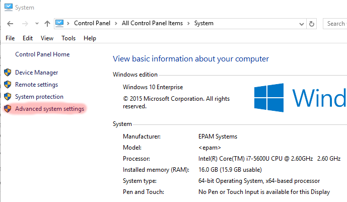
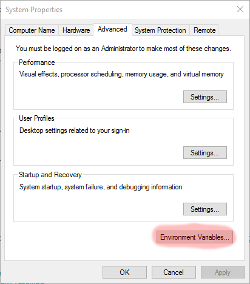
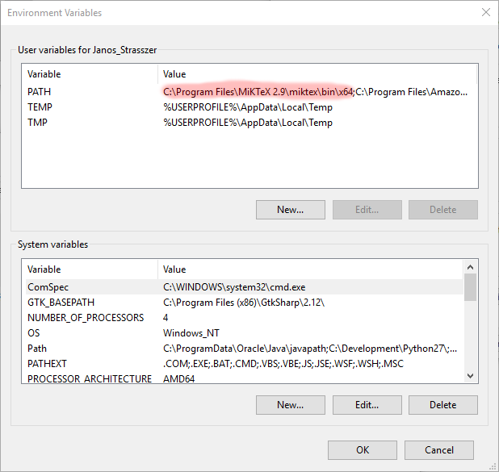
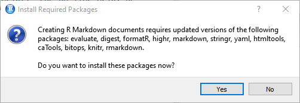

# Configuring Rmd and PDF support for RStudio on Windows

Rmd = R Markdown is a file format based on Markdown that contains formatted text and runnable R code to produce nice reproducible publications. RStudio can create HTML or PDF files from Rmd.

## Requirements
 * rmarkdown plugin installed
 * MiKTeX 2.9 (or newer version) installed

## Install MiKTeX
1. Download 32 or 64 bit version of MiKTeX from http://miktex.org/2.9/setup (Use Basic MiKTeX installer) and install it
Warning it is a large file (~200 Mb)

2. Add MiKTeX to windows PATH
	a. Open System settings in Windows (Control Panel/System)
	b. Open Advanced System Settings
    

    c. Open System Properties
    

    d. Add new PATH entry in the user variables section (or copy before the existing value and separate them with ; )
    

    e. Restart RStudio

## Install rmarkdown
1. Open RStudio
2. Choose File/New File/R Markdown...
3. RStudio will ask your confirmation to install rmarkdown and its dependencies. Select Yes
   
4. RStudio will install all the needed packages
5. Try again to create a new R Markdown document. If RStudio is unable to find rmarkdown then it was unable to install it previously (The error message dissapear to quickly to see it)
6. Install it manually:
```{r}
install.packages("rmarkdown")
```

7. Try to create the document again, it should work now
